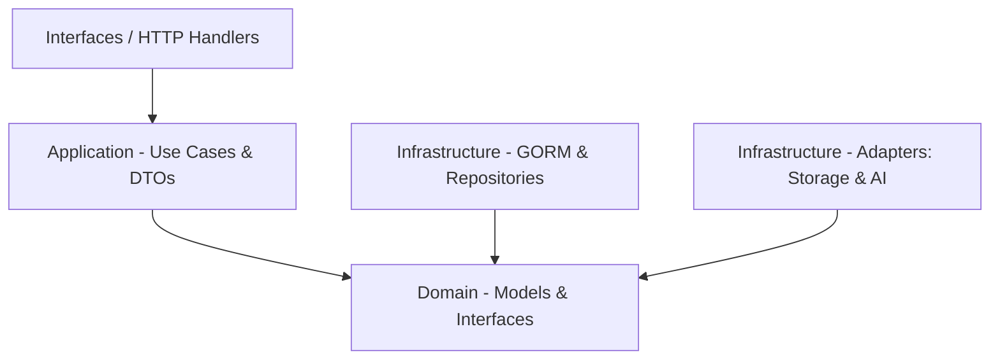

# 🏋️‍♂️ Gestrym Progress Microservice (`gestrym.progress.back`)


El microservicio **`gestrym.progress.back`** forma parte del ecosistema **Gestrym**. Su objetivo principal es gestionar el seguimiento del progreso físico de los usuarios, incluyendo métricas corporales, fotografías de evolución, registro de rutinas completadas, notas de entrenadores, comparativas visuales y la activación reactiva de algoritmos de **Inteligencia Artificial** para adaptar de manera inteligente los planes de entrenamiento y nutrición.

---

## 📌 Tabla de Contenidos
- [✨ Características Principales](#-características-principales)
- [🏗️ Arquitectura del Sistema](#️-arquitectura-del-sistema)
- [📁 Estructura del Proyecto](#-estructura-del-proyecto)
- [🚀 Endpoints de la API](#-endpoints-de-la-api)
- [🤖 Integración Reactiva con IA (Smart Coach)](#-integración-reactiva-con-ia-smart-coach)
- [🔐 Autenticación y Reglas de Autorización](#-autenticación-y-reglas-de-autorización)
- [⚙️ Variables de Entorno](#️-variables-de-entorno)
- [🛠️ Instalación y Ejecución Local](#️-instalación-y-ejecución-local)
- [📚 Documentación Abierta (Swagger & Frontend Guide)](#-documentación-abierta-swagger--frontend-guide)

---

## ✨ Características Principales

1. **📊 Métricas Corporales**: Registro y consulta histórica de peso, altura, porcentaje de grasa corporal y masa muscular.
2. **📸 Fotos de Progreso**: Subida multipart/form-data e historial de fotografías (frontal, espalda, lateral) integradas con el microservicio de almacenamiento (MinIO).
3. **📈 Visualización de Gráficas**: Endpoint `/chart` optimizado para consumo directo por librerías frontend como Chart.js o Recharts.
4. **🔄 Comparativa Antes vs. Ahora**: Obtención directa de la primera y última muestra de fotos y métricas del usuario.
5. **🏋️ Registro por Rutina Completada**: Vinculación de entrenamientos finalizados (duración, fecha, notas) consumiendo la información del `training-service`.
6. **🧑‍🏫 Notas de Entrenadores**: Sistema de retroalimentación de los coaches hacia los usuarios (protegido con control de acceso RBAC).
7. **🤖 Asistencia Reactiva por IA**: Disparo automático y asíncrono de re-evaluaciones de planes de entrenamiento/nutrición ante cambios corporales significativos (> 0.5kg) o nueva evidencia fotográfica.

---

## 🏗️ Arquitectura del Sistema

El proyecto está diseñado bajo los principios de la **Arquitectura Hexagonal (Puertos y Adaptadores)**, garantizando el desacoplamiento de la lógica de negocio frente a la infraestructura externa.



- **Domain Layer (`src/progress/domain`)**: Contiene las entidades base, modelos del sistema e interfaces (puertos) para repositorios y servicios externos (`StorageService`, `AIService`).
- **Application Layer (`src/progress/application`)**: Lógica de negocio encapsulada en Casos de Uso (`usecases/`) y Data Transfer Objects (`dtos/`).
- **Infrastructure Layer (`src/progress/infrastructure`)**: Implementaciones concretas de persistencia con GORM/PostgreSQL y adaptadores de clientes HTTP para servicios externos (MinIO Storage, AI Service).
- **Interfaces Layer (`src/progress/interfaces/http`)**: Controladores Gin HTTP, rutas y middlewares de seguridad.

---

## 📁 Estructura del Proyecto

```text
gestrym.progress.back/
├── main.go                       # Punto de entrada principal (Flags y servidor)
├── go.mod / go.sum               # Gestión de dependencias de Go
├── IA_MEMORY.md                  # Bitácora de arquitectura y memoria técnica del proyecto
├── FRONTEND_INTEGRATION_GUIDE.md # Guía para desarrolladores frontend
├── docs/                         # Documentación generada por Swagger (OpenAPI 2.0)
└── src/
    ├── app.go                    # Inicialización de configuración, DB y Gin Engine
    ├── common/                   # Módulos transversales y reutilizables
    │   ├── config/               # Manejo de DB (GORM), Migraciones y Viper Env
    │   ├── middleware/           # Middlewares de Autenticación JWT y Roles
    │   ├── models/               # Modelos GORM (BodyMetrics, ProgressPhoto, CoachNote, WorkoutProgress)
    │   ├── routes/               # Registro central de rutas HTTP
    │   ├── shared/               # Tipos y utilidades compartidas
    │   └── utils/                # Loggers y validadores
    └── progress/                 # Dominio de Progreso (Arquitectura Hexagonal)
        ├── application/          # Casos de uso (Metrics, Photos, Notes, Comparison, Workout) y DTOs
        ├── domain/               # Entidades de dominio, interfaces de repositorios y puertos
        ├── infrastructure/       # Repositorios GORM y Adaptadores HTTP (StorageService, AIService)
        └── interfaces/http/      # Handlers/Controllers de Gin y mapeadores de request
```

---

## 🚀 Endpoints de la API

Todos los endpoints están protegidos por autenticación JWT y expuestos bajo el prefijo `/gestrym-progress/private`.

| Categoría | Método | Endpoint | Descripción | Requiere Rol |
| :--- | :---: | :--- | :--- | :---: |
| **Métricas** | `POST` | `/private/metrics` | Registra peso, altura, % grasa y masa muscular | Cliente / Admin |
| **Métricas** | `GET` | `/private/metrics/user/:id` | Historial de métricas (Soporta `limit` y `offset`) | Propietario / Coach |
| **Gráficas** | `GET` | `/private/metrics/user/:id/chart` | Listado cronológico de `(fecha, peso)` para gráficas | Propietario / Coach |
| **Fotos** | `POST` | `/private/photos` | Sube foto de progreso (`multipart/form-data`: `file`, `type`, `date`) | Cliente / Admin |
| **Fotos** | `GET` | `/private/photos/user/:id` | Obtiene el listado de fotos registradas | Propietario / Coach |
| **Comparación** | `GET` | `/private/comparison/user/:id` | Muestra primera vs última foto y métrica (Antes vs Ahora) | Propietario / Coach |
| **Rutinas** | `POST` | `/private/workout-progress` | Marca una rutina completada (duración, fecha, notas) | Cliente / Admin |
| **Rutinas** | `GET` | `/private/workout-progress/user/:id` | Historial de entrenamiento realizado | Propietario / Coach |
| **Notas Coach** | `POST` | `/private/notes` | Entrenador asigna observaciones a un alumno | Coach / Admin |
| **Notas Coach** | `GET` | `/private/notes/user/:id` | Consulta notas enviadas por el entrenador | Propietario / Coach |

---

## 🤖 Integración Reactiva con IA (Smart Coach)

El microservicio está conectado de manera directa y reactiva con el **`ai-service`** para mantener los planes de entrenamiento y nutrición adaptados en tiempo real.

- **Disparadores (Triggers)**:
  1. **Métricas Físicas**: Se evalúa la diferencia con la última métrica. Si el cambio de peso es mayor a **0.5 kg**, se solicita re-evaluación a la IA.
  2. **Fotos de Progreso**: Cada subida de foto genera un evento de re-evaluación para considerar posibles cambios estéticos.
- **Ejecución Asíncrona (Non-blocking)**: La solicitud al `ai-service` corre en *goroutines* independientes. La API responde inmediatamente al cliente sin demoras en el flujo principal.
- **Resiliencia**: Si el microservicio de IA se encuentra inactivo o experimenta fallas, el error queda registrado en logs sin afectar la persistencia de los datos del usuario.

---

## 🔐 Autenticación y Reglas de Autorización

- **JWT Middleware**: Extrae `user_id` y `role_id` del token JWT enviado en la cabecera `Authorization: Bearer <TOKEN>`.
- **RBAC (Role-Based Access Control)**:
  - **`CLIENTE`**: Solo puede crear y visualizar su propio progreso.
  - **`COACH` / `ADMIN`**: Tienen permiso para ver la evolución de cualquier alumno a su cargo y añadir notas de feedback.

---

## ⚙️ Variables de Entorno

El microservicio utiliza **Viper** para administrar la configuración mediante archivo local o variables del sistema (Render, Docker, etc.).

| Variable | Descripción | Requerido |
| :--- | :--- | :---: |
| `GESTRYM_PROGRESS_SERVER_ADDRESS` | Puerto/Dirección del servidor (ej: `:8084`) | Sí |
| `GIN_MODE` | Modo de Gin (`debug`, `release`, `test`) | Sí |
| `POSTGRES_DB_HOST` | Host de la base de datos PostgreSQL | Sí |
| `POSTGRES_DB_PORT` | Puerto de PostgreSQL (ej: `5423`) | Sí |
| `POSTGRES_DB_USER` | Usuario de PostgreSQL | Sí |
| `POSTGRES_DB_PASSWORD` | Contraseña de PostgreSQL | Sí |
| `POSTGRES_DB_NAME` | Nombre de la base de datos | Sí |
| `POSTGRES_DB_SSLMODE` | Modo SSL (`disable`, `require`) | Sí |
| `JWT_KEY` | Clave secreta para validación de tokens JWT | Sí |
| `STORAGE_SERVICE_URL` | URL base del microservicio de almacenamiento (MinIO) | Sí |
| `STORAGE_SERVICE_API_KEY` | API Key para autenticación con el servicio de Storage | Sí |
| `GORM_LOG_LEVEL` | Nivel de logging de GORM (`info`, `warn`, `error`, `silent`) | Sí |

---

## 🛠️ Instalación y Ejecución Local

### Prerrequisitos
- [Go 1.25+](https://go.dev/doc/install)
- Instancia de PostgreSQL disponible.

### Pasos
1. **Clonar el repositorio:**
   ```bash
   git clone https://github.com/tu-usuario/gestrym.progress.back.git
   cd gestrym.progress.back
   ```

2. **Instalar dependencias:**
   ```bash
   go mod download
   ```

3. **Configurar entorno local:**
   Asegúrate de contar con el archivo de configuración `./deployment/env_local.yaml` con las credenciales de tu base de datos local y endpoints requeridos.

4. **Ejecutar el servidor en ambiente de desarrollo:**
   ```bash
   go run main.go --local=true
   ```

5. **Compilar para producción:**
   ```bash
   go build -o gestrym-progress main.go
   ./gestrym-progress
   ```

---

## 📚 Documentación Abierta (Swagger & Frontend Guide)

- **Guía de Integración Frontend**: Consulta la guía técnica detallada en [`FRONTEND_INTEGRATION_GUIDE.md`](./FRONTEND_INTEGRATION_GUIDE.md).
- **Swagger / OpenAPI**: Una vez desplegado el servidor, puedes acceder a la interfaz Swagger interactiva navegando a:
  ```text
  http://<HOST>:<PORT>/swagger/index.html
  ```

---

*Desarrollado con ❤️ para la plataforma Gestrym.*
